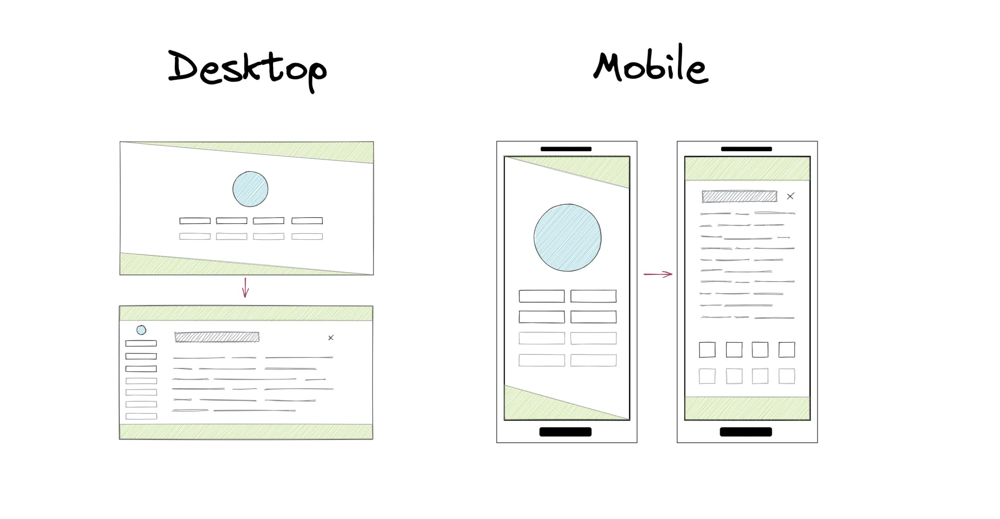

# My personal website

<p align="center">


</p>

This is the second iteration of my personal website. It's live on [itamarga.com](https://itamarga.com) since 3/10/2021.

The old version's repo is [here](https://github.com/pitamer/itamarga.com_old) (was live 12/9/2020 - 3/10/2021).

## Design and development

Svelte seemed intriguing, so I started learning it.
Somewhere along the [tutorial](https://svelte.dev/tutorial/basics) it became clear to me that I needed to make my new personal website with it.
And use a ton of crossfades.

So I went and made this wireframe with [Excalidraw](https://excalidraw.com):



<sup><sub>
The idea of the top and bottom decoration lines came from a specific scrolling point in the [Rocket](https://rocket.rs/) project homepage (You can spot it easily if it's still there).
</sub></sup>

The final result looks just a tiny bit different. I think I like it.

## Intentionally uncopyrighted

No permission is needed to copy, distribute or modify the content of this repo. Credit is appreciated but not required.


## Project setup

Install the dependencies...

```bash
npm install
```

...then start [Rollup](https://rollupjs.org):

```bash
npm run dev
```

Navigate to [localhost:5001](http://localhost:5001).

### Building and running in production mode

To create an optimised version of the app:

```bash
npm run build
```

You can run the newly built app with `npm run start`. This uses [sirv](https://github.com/lukeed/sirv), which is included in your package.json's `dependencies` so that the app will work when you deploy to platforms like [Heroku](https://heroku.com).

---

<h1 align="center">😄</h1>